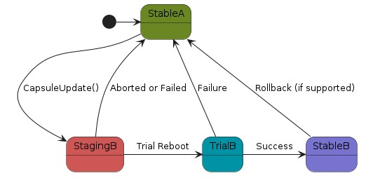

<!--SPDX-License-Identifier:** CC-BY-SA-4.0-->
# Introduction

Firmware updates in the Arm ecosystem have historically been handled by proprietary methods. Standardizing firmware behavior and lifecycle is necessary to create broader business opportunities in the ecosystem.

The firmware update process is highly platform-dependent, but it can be standardized under the assumption that firmware addresses platform-specific aspects. 

**The firmware update process is driven by the main operating system using standard UEFI capsule technology, ensuring processor and OS implementation independence.**  
**The creation of update capsules and their signatures is outside the scope of this document.**

This document focuses on the robustness of the update process to achieve:

- Brick protection (not limited to firmware upgrades)
- Rollback capabilities (if permitted)
- Rollback protection

Unexpected issues, such as hardware revision differences, language configuration, and operational conditions, may occur despite extensive testing. Therefore, the OS must verify and approve updates before committing them. This is referred to as **transactional updates** throughout the document.

The aim of this document is to provide guidelines to protect devices against bricking and rollback attacks. Updates may occur from the non-secure world (non-secure firmware) or the secure world (secure firmware), depending on implementation and hardware requirements.

*Comments or change requests can be sent to `boot-architecture@lists.linaro.org`.*

## Scope

Dependable Boot addresses the lack of firmware upgrade standardization in embedded systems. As embedded systems become more sophisticated and connected, it is increasingly important to standardize firmware upgrades to protect devices against unauthorized updates, defective updates, and hardware failures.

## Requirements and Key Concepts

### Prerequisites

This document targets [EBBR] and [PSBG]-compliant systems. Platforms without UEFI are outside its scope.

- Every firmware binary **must** support dual A/B partitions for all components.
- The first-stage bootloader **must** access the firmware NVCounter.
- UEFI capsule updates are the delivery mechanism for firmware updates. refer to [[1]](#ueficapsuleupdatenote) for more details.
- The immutable stage loader **must** load the second-stage bootloader (e.g., TF-A) from a dual image. If the ROM cannot boot from an alternative location, the secondary bootloader inherits these responsibilities.
- Updating the firmware and the OS simultaneously is prohibited.
- A hardware watchdog **must** be active during critical components' execution and reset the board if a timeout occurs.

[ueficapsuleupdatenote]: https://gitlab.com/Linaro/trustedsubstrate/mbfw/-/blob/master/source/chapter1-about.rst?ref_type=heads&plain=0#id3
>[[1]](#ueficapsuleupdatenote) [UEFI]_2.8B § 23 - Firmware Update and Reporting]

### Transactional Updates

Firmware updates are independent of OS upgrades. If the OS fails after a firmware update, the device must revert to the previous firmware. 

Scenarios include:

1. **Firmware Acceptance Test Fails:** The OS requests a downgrade using the [revert-sec](#revert-sec) methodology.
2. **OS Boot Failure:** The Normal World firmware counts failed boot attempts. After a threshold, it reverts to the previous firmware bank.

If the firmware passes acceptance tests, it becomes permanent. The OS uses an acceptance capsule ([OS-Directed FW Image Acceptance](#os-directed-fw-image-acceptance)) to finalize this.

### Rollback Protection

Rollback attacks exploit older, vulnerable firmware. Devices **must** prevent downgrades to insecure versions. If an older version is detected:

- Check backup partitions for a valid version.
- If both partitions are invalid, the device enters a reboot loop.

### Brick Protection

Brick protection addresses issues during updates and hardware failures. Recommendations:

- Update both partitions if rollback counters are bumped.
- Restore a partition to a working state if an update fails.
- Ensure watchdog timers are active during updates.

