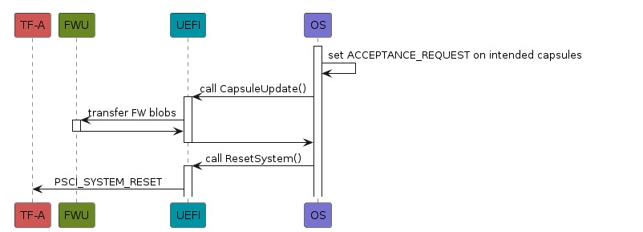
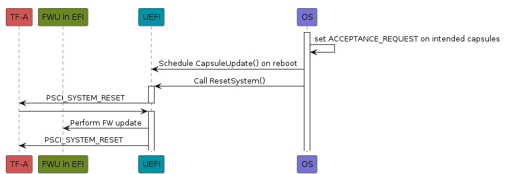
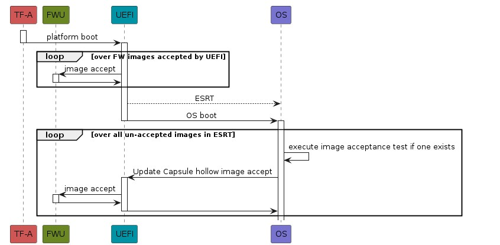
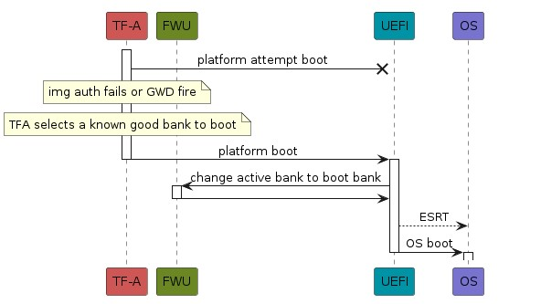
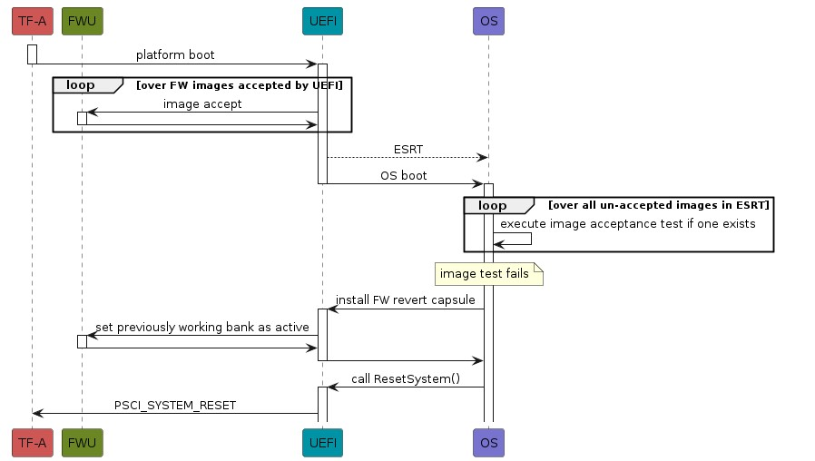

<!--SPDX-License-Identifier: CC-BY-SA-4.0-->

# Secure Firmware on non-Secure firmware updates

## Firmware Flash owned by Secure World

If the flash device is owned by the Secure World, the FMP managing the FW
images must communicate the FW images to the Firmware Update Implementation
[FWU]_.
The Firmware Update
Implementation in Secure World [FWU]_ writes the FW images to flash.
In this model the OS can install the
capsule by invoking the UEFI UpdateCapsule runtime service. The capsule can
be installed, by the UEFI Implementation, without requiring a system reboot.

The FWU metadata [FWU]_ is managed by the FWU Implementation in the Secure world.
The FWU metadata is described in Section 4.1 of [FWU]_.

When the flash is owned by the Secure World, the FMP communicates with the FWU Implementation
in the secure world using the [FFA]_ Firmware Update ABI [FWU]_

The FWU Implementation provides Non-secure firmware with a list of all FW images handled by it.  The information
is provided via the image directory [#FFANote]_.

.. [#FFANote] image directory is a stream of data structured as an array of image entries [FWU]_.

### FMP interface for Secure World updates

The FMP is responsible for committing the FW images to flash and to provide the information used to
construct the ESRT table.

Each image entry in the FWU image directory exposes a set of fields which map directly to the
EFI_FIRMWARE_IMAGE_DESCRIPTOR as defined in the following table:

.. table:: EFI_FIRMWARE_IMAGE_DESCRIPTOR Implementation Requirements

   | FWU image directory entry field | EFI_FIRMWARE_IMAGE_DESCRIPTOR |
   |---------------------------------|-------------------------------|
   | img_type_uuid |  ImageTypeId |
   | lowest_accepted_version | LowestSupportedImageVersion |
   | last_attempted_version  | LastAttemptedVersion |
   | version | Version |
   | image_max_size |   Size |
    

## Firmware Flash owned by non-Secure World

If the flash device is owned by the Normal World, the FW images must be written to it directly by
the UEFI implementation.

Two models exist in this platform model:

- The OS places the capsule on the EFI system partition in the /efi/updatecapsule directory, as
  defined in § 8.5.5 - Delivery of Capsules via file on Mass Storage device [UEFI]_. After this
  the OS requests a platform reset.  The OS may optionally install an update application which
  installs the capsule at the next reboot.

- The OS calls the UEFI UpdateCapsule runtime service. The Capsule must have the
  CAPSULE_FLAGS_PERSIST_ACROSS_RESET bit set in the EFI_CAPSULE_HEADER flags field.
  The implementation must correctly flush all caches prior to performing the warm reset.

The FWU metadata [FWU]_ is managed by the UEFI implementation.
The FWU metadata is described in Section 4.1 of [FWU]_.

## Example flows

### Capsule install Secure World

1. OS receives a capsule with the new firmware
2. OS sets the acceptance request bit the Capsule header for all the images it wants to accept
3. OS passes the capsules to the UpdateCapsule runtime service
4. UEFI implementation traverses all the images in the capsule passing them to their corresponding FMPs
5. The FMP transfers the images to the FWU Implementation in the Secure World [FWU]_
6. OS requests a system reboot

### Capsule install non-Secure World

1. OS receives a capsule with the new firmware
2. OS sets the acceptance request bit the Capsule header for all the images it wants to accept
3. OS schedules a CapsuleUpdate on disk and reboots
4. UEFI implementation traverses all the images in the capsule passing them to their corresponding FMPs
5. The UEFI firmware performs the update
6. UEFI firmware requests a system reboot

### Post-capsule install -- Reboot success

.. note:: When the Normal world controls flash, FWU and UEFI are within the same \
   execution context.  In this case, the activations and returns between FWU and \
   UEFI are internal to the UEFI implementation.

1. Platform boots with the new FW
2. From the TFA boot report [FWU]_, UEFI verifies that platform booted from the intended bank
3. UEFI accepts a sub-set of the FW images [FWU]_ (the sub-set is platform specific)
4. OS loader obtains the ESRT from UEFI
5. OS boots
6. OS inspects the information in the ESRT
7. OS performs an image acceptance test for any un-accepted image
8. If all image tests pass correctly the OS exits the FW update procedure
9. OS install the image acceptance capsule when all acceptance tests pass
10. Firmware processes the image acceptance capsule and updates the boot bank
11. Rollback counter updates
    - If the Non-secure firmware can update the rollback counter(s) directly, it should do it on the fly
    - Otherwise, on the next reboot Secure firmware must detect the new version
      (rollback counter < fw rollback counter)and update the rollback counter(s) accordingly.

### Post-capsule install -- Reboot fails before UEFI

.. note:: When the Normal world controls flash, FWU and UEFI are within the same \
   execution context.  In this case, the activations and returns between FWU and \
   UEFI are internal to the UEFI implementation.

1. Platform boots with the new FW
2. The images fail to authenticate or the generic watchdog fires
3. Platform resets
4. Early platform bootloader detects FW malfunction and selects another bank to boot from
5. UEFI receives the report from TFA of the failed boot attempt
6. UEFI effectivates the permanent bank change
7. UEFI generates the ESRT reflecting the bank that booted the system
8. OS loader obtains the ESRT from UEFI
9. OS boots
10. OS inspects the information in the ESRT

### Post-capsule install -- OS fails to boot

.. note:: When the Normal world controls flash, FWU and UEFI are within the same \
   execution context.  In this case, the activations and returns between FWU and \
   UEFI are internal to the UEFI implementation.

1. Platform boots with the new FW
2. From the TFA boot report [FWU]_, UEFI verifies that platform booted from the intended bank
3. OS loader obtains the ESRT from UEFI
4. OS boot fails and *max_trial_boots* is reached
5. The FW automatically selects the previously working FW bank and reboots
6. OS Boots

### Post-capsule install -- Image fails OS test

.. note:: When the Normal world controls flash, FWU and UEFI are within the same \
   execution context.  In this case, the activations and returns between FWU and \
   UEFI are internal to the UEFI implementation.

1. Platform boots with the new FW
2. From the TFA boot report [FWU]_, UEFI verifies that platform booted from the intended bank
3. UEFI accepts all images [FWU]_
4. OS loader obtains the ESRT from UEFI
5. OS boots
6. OS inspects the information in the ESRT
7. OS performs an image acceptance test for any un-accepted image
8. If any image tests fails, the OS install a "FW downgrade request" capsule, instructing UEFI to select the previously working FW bank, or imediately reboots.
9. OS requests a system reset
