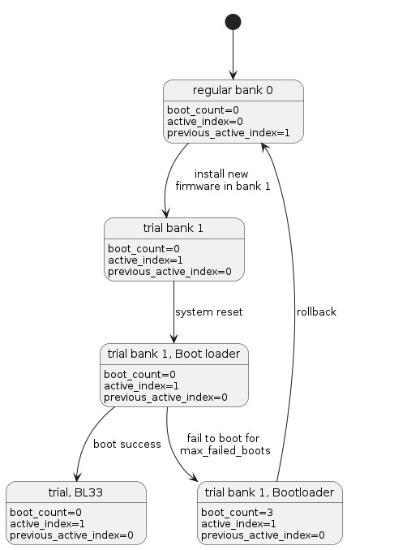
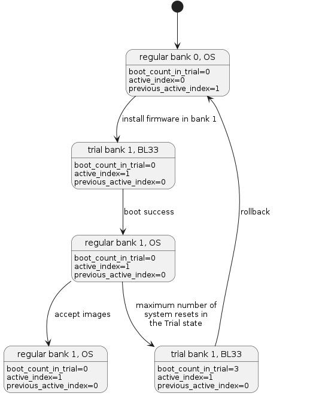

<!-- SPDX-License-Identifier: CC-BY-SA-4.0 -->

# Fail-safe system boot

The system firmware may become corrupted during update. Likewise, data kept in the Firmware Store can become corrupted due to natural degradation of the flash device.
When this happens, the system will fail to boot.
The system must be designed to be robust against failures in the update process and against corruption of data in non-volatile storage.

In a similarly way to firmware image corruption, the update metadata [FWU]_ can also become corrupted.
There are always two instances of the update metadata in the non-volatile medium, each instance is updated in sequence.
The update in sequence guarantees that, even if the update of an instance is interrupted, there is always one intact metadata instance.
In the case of natural degradation of a metadata instance, this is unlikely to occur simultaneously for both instances. Considering this more complex model, there is a high likelihood that at least one instance of the metadata is intact.
When the Update Agent detects that a metadata instance is corrupted, it overwrites the corrupted instance with the intact instance.

The firmware must detect situations where the platform fails consecutively to boot for an unreasonable number of times or when the platform is left in a Trial state indefinitely.
In that situation, the firmware must take actions to rollback to the previously active firmware.
The previously active firmware must pass any anti-rollback checks before being allowed to execute on the platform.

In this design, there are two levels of fail-safe boot.
The first one is implemented at the early bootloader. There the firmware detects if a subsequent stage continuously fails to boot by inspecting a reset syndrome register.
The second level of fail-safe boot ensures that the system is not permanently left in the Trial state, either because the OS failed to accept the images or because the OS is unable to boot successfully.

## Early firmware fail-safe boot

The early bootloader is responsible for loading the subsequent firmware stages into RAM.
The early bootloader loads the active bank by default. If the active bank fails to boot, the early bootloader will increment a failed_boot counter. When the value in failed_boot counter is higher that the *max_failed_boots* threshold, then the early bootloader must select the previous_active bank.

These state transitions are modelled in :ref:`Firmware fail-safe <fw_fail-safe>`. In this diagram the early stage bootloader, when the platform fails to boot for more than *max_failed_boots*, will select a bank other than the current active one.
In that case *boot_index* will differ from *active_index*, a firmware entity, either early bootloader or the UEFI implementation, should rollback the firmware at this point.

Early bootloader fail-safe state machine.

## OS fail-safe boot

The OS may fail to boot because of an incompatibility with the current platform firmware. Alternatively the OS may have mistakenly left the platform in the Trial state permanently.
In both these scenarios the UEFI implementation can track for the number of consecutive boots in the Trial state.
When the handoff from the UEFI implementation to the OS occurs more than a given number of times in the Trial state, the UEFI implementation must request a revert of the firmware to the previously active firmware. By design the previously active firmware is still present in the Firmware Store and is in the Regular state.

The state transition for the UEFI implementation controlled Trial state limitation are shown in :ref:`OS fail-safe <os_fail-safe>`

OS fail-safe boot state machine.
