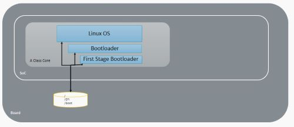
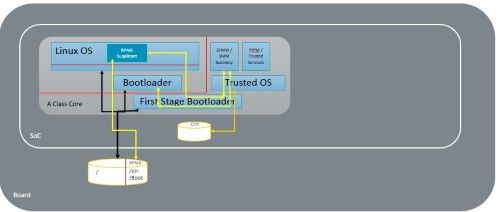
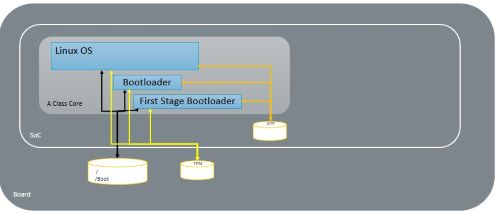
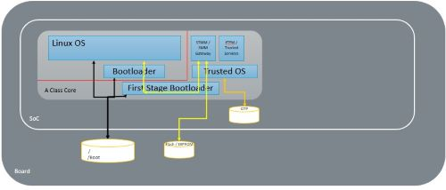
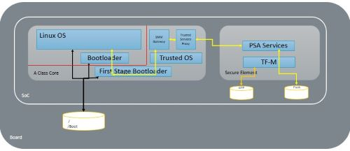

<!-- SPDX-License-Identifier: CC-BY-SA-4.0 -->

# Hardware design options for Secure Storage

## Table of Contents
- [Introduction](#introduction)
- [Hardware options](#hardware-options)
  - [Storage in normal world only](#storage-in-normal-world-only)
  - [Storage in eMMC/RPMB](#storage-in-emmcrpmb)
  - [Storage in external TPM](#storage-in-external-tpm)
  - [Storage in Flash/EEPROM](#storage-in-flasheeprom)
  - [Storage via Secure Element](#storage-via-secure-element)
- [Conclusions](#conclusions)

## Introduction  
  
1. [SystemReady][SystemReady] specifies the API’s firmware must expose to and OS in order to support Secure Boot usecases, however it does not enforce that the API’s are actually implemented in a secure manner.​
2. [PSA][PSA] certification specifies a number of runtime security features that should be supported, It also attempts to verify they have been implemented in a secure manner.​
   - At Level 2 and above this involves a full code audit of everything below the security API​
   - The API is only specified if you wish to gain the additional PSA Level2 API certification.​
3. This means your hardware choice is wide and not fixed but certain choices will restrict what security level certifications you could achieve​

## Hardware options
### Storage in normal world only

In the most simple scenario, as shown in figure 1, a single storage medium is used connecting to everysingle firmware and software component, which where EFI variables live on a file within that media and u-boot is compiled to use that file.
From a systemReady perspective, standard interfaces are used therefore ensuring interoperability between sofware modules, however this implementation choice is secure, hence failing to meet PSA requirements.

_figure 1: Storage in normal world diagram_

### Storage in eMMC/RPMB
In this design option, the actual storage has two partitions, one hosting the rootfs and the other hosting the efi variables, in such a way that the one hosting variables is hidden from the normal-world. The downside to this, is the access to this storage is done through Linux, therefore an OTP is essential to hold the keys locking and unlocking the access to RPMB. this is certainly more secure as the first option and it would be passing PSA level 1 as some sort of secure storage is present but it definetly won't achieve PSA level 2 as this configuration implies all the software stack is related to the access to the secure storage so the whole software stack is subject to audition, which is very time consuming and everytime a firmware of software update happens another audit should be carried out, making it simply impractical to achieve PSA level 2. In terms of PSA API it could apply if fTPM or Trusted sources were used.  

A tempting alternative to having to use OTP to store the keys is for TF-A to encrypt the bootloader so keys are assumed to be protected, however then your design will be open to another level of attacks as the key in bootloader would cover a group of devices rather than being independent keys per device, and this may not even comply with PSA level 1

_figure 2: Storage in eMMC/RPMB diagram_

### Storage in external TPM

In this case described in figure 3, all the secure services, including secure storage, are handled by the TPM, however because the TPM is not embedded within the SoC there's a risk the bus connecting the TPM to the SoC can be snooped, unless the bus is using locking mechanisms and encrypted communications, which then will require an OTP to store the encryption keys for that bus communications. This also includes problems when using Linux OS as each application whenever needs to use the TPM they will have to have an unlocking key, which is impractical.
Nevertheless this design could achieve PSA Level 3, because the audit would be restricted to just the API handling the bus communications between the SoC and the TPM, which is a manageable piece of code to audit. On the other hand, given this design would not be compliant to PSA API as using an external TPM.

_figure 3: Storage in external TPM diagram_

### Storage in Flash/EEPROM
In the next level, a Flash or EEPROM only accessible from Secure world, can be treated in a similar way where an OTP can be used to store the keys handling the locking and encryption of the bus connecting the SoC to the Flash/EEPROM.

In this case, PSA Level 2 certification could be achieved as code auditing is limited to the trusted world and Flash contents access, which is a practical thing to do given the bootloader and trusted firmware is a fairly fix asset not expected to be updated so often and changes to the OS would not invalidate PSA certification.

as a difference from previous scenario, PSA API could be used if fTPM and trusted services are chosen.

_figure 4: Storage in Flash/EEPROM diagram_

### Storage via Secure element

The final design option, shown in figure 5, is when an internal secure element to the SoC is used to provide secure services. Given this is using an internal element, there's no bus snoop and there's no need to lock and ecrypt the communications to and from the secure flash. At this point the OTP still can be used to store keys, although it is not estrictly necessary to use them to protect the bus connnecting the Flash, but it still can be used the de-encrypt some other software components as the first stage bootloaders.
In terms of PSA certification Level 2 is not a problem and level 3 is also achievable, given the secure services are well delimited within this enclave, also it would also be using PSA APIs.

As an alternative, the secure element, could be replaced by an internal TPM to the SoC, but it wouldn't be PSA API. 

_figure 5: Storage via secure element diagram_

## Conclusions

| Standard  | Normal World | eMMC/RPMB |   External TPM |  Flash/EEPROM | Secure Element |
|-----------|--------------|-----------|----------------|---------------|----------------|
| SystemReady Devicetree band    |   |  |   |    |   |
| PSA level      |    | __1__ | __3__ | __2__ | __3__ |
| PSA API     |     | __?__ |      | __?__ |     | 

[SystemReady]: https://www.arm.com/architecture/system-architectures/systemready-compliance-program/systemready-devicetree-band
[PSA]: https://www.psacertified.org/
